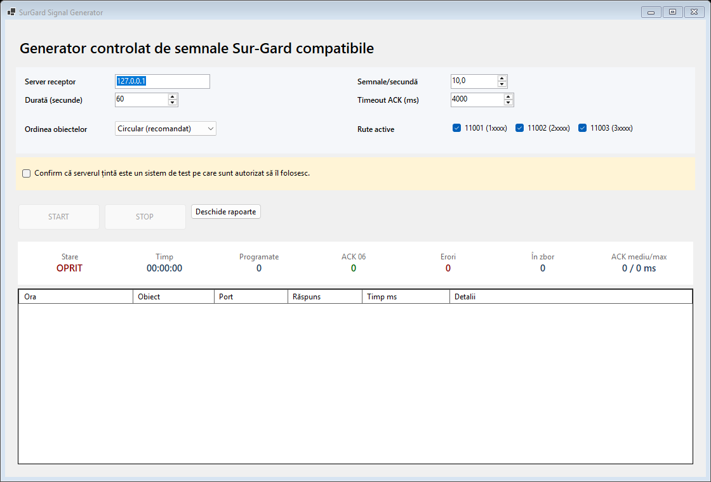

# SurGard Signal Generator

Aplicație Windows pentru generarea controlată a unor cadre de alarmă compatibile Sur-Gard, destinată testelor de laborator, validării integrărilor și măsurării răspunsului unui receptor TCP.

> Acesta este un proiect independent, neoficial și nu este afiliat cu DSC, Johnson Controls sau proprietarii mărcii Sur-Gard. Folosiți aplicația numai pe sisteme pentru care aveți autorizare explicită.

## Ce oferă

- generare de cadre PIMA/Sur-Gard cu evenimente Contact ID variabile;
- rutare pe trei porturi TCP configurate după prefixul identificatorului;
- rată și durată de test configurabile;
- limitarea transmisiilor concurente și timeout pentru ACK;
- oprire imediată și confirmare obligatorie înainte de pornire;
- statistici în timp real pentru ACK, erori și latență;
- raport CSV pentru fiecare sesiune;
- identificatori demonstrativi și adresă implicită `127.0.0.1`.



## Cerințe

- Windows 10/11 sau Windows Server;
- [.NET 10 SDK](https://dotnet.microsoft.com/download/dotnet/10.0) pentru compilare.

## Compilare și testare

```powershell
dotnet build SurGard-Signal-Generator.slnx -c Release
dotnet run --project tests/SurGardSignalGenerator.Tests/SurGardSignalGenerator.Tests.csproj -c Release
```

Pornirea aplicației:

```powershell
dotnet run --project src/SurGardSignalGenerator/SurGardSignalGenerator.csproj -c Release
```

## Utilizare sigură

1. Porniți mai întâi un receptor în mediul de test.
2. Introduceți adresa receptorului; implicit este localhost.
3. Alegeți rata, durata și rutele active.
4. Confirmați că sunteți autorizat să testați sistemul țintă.
5. Apăsați `START` și verificați sumarul înainte de transmitere.
6. Folosiți `STOP` pentru anularea programării și a conexiunilor active.

Rapoartele sunt salvate în `%LOCALAPPDATA%\SurGardSignalGenerator\reports`.

## Structură

- `src/SurGardSignalGenerator` — aplicația Windows Forms și motorul de generare;
- `tests/SurGardSignalGenerator.Tests` — teste de protocol și integrare locală;
- `.github/workflows` — build și test automat pe Windows.

## Licență

Codul este disponibil sub licența [MIT](LICENSE).
